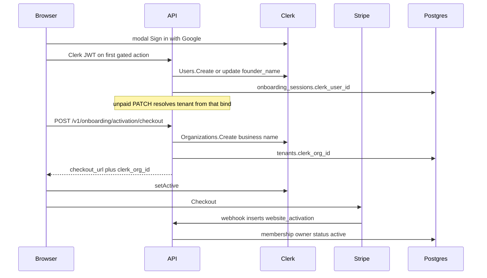

# Auth — architecture

Identity, Clerk SDK mapping, tenant locators, and `/me`. Named
identifiers:
[docs conventions](../../../docs-conventions.md#named-identifiers).
Tables: [persistence.md](persistence.md). HTTP: [api.md](api.md).

Packages: `internal/auth` (Clerk SDK → `Principal`) and
`internal/tenancy` (SQL). `Principal` is the Go request identity after
`VerifySession` (`userID`, `orgID`, `platformRole`, impersonation
`actor`). It is not a tenant, not `MeRead`, and not on HTTP.

## Mapping

- **Data tenant** = `auth.tenants` row. `tenant_id` on every
  tenant-owned row.
- **Clerk organization** = that tenant, **1-1**. That is the only
  1-1. Name and logo are the **business** (`tenants.name` / profile
  `display_name`, business logo). Not the owner’s personal name.
- **Clerk users** to a tenant (and its Clerk org) are **1-many**.
  Schema is `tenant_memberships` (many rows per `tenant_id`). Do
  **not** unique `clerk_user_id` or `tenant_id`. Do **not** write
  resolvers that assume one membership per tenant or one tenant per
  owner.
- **Clerk user** = **owner** (the person) on the first insert. Not
  “contractor”. First write of the owner display name is
  **programmatic** from
  **`founder_name`**. After that the owner can change it in the Clerk
  UI in the app. Do not overwrite a later Clerk edit with
  `founder_name`. They authenticate with **OAuth** (Sign in with
  Google; same shape for other Clerk social providers if enabled).
  Email is the Google account email.
- **Today’s usage** (not a constraint): we only insert one owner.
  **TBD:** office / admin staff on the same tenant with **equal**
  permissions. Keep `role` as `owner` only. Do not invent `admin` /
  `staff` or invite flows.

## Named identifiers

HTTP (same spelling in spec, Go, and tests):

**`internal/auth`**

- `VerifySession` — Clerk SDK `Sessions().Verify` →
  `Principal{userID, orgID, platformRole, actor}`. `actor` is Clerk
  native impersonation. Not on HTTP.
- `CreateClerkUser` — Clerk SDK `Users().Create` (or update on first
  bind if the OAuth account already exists). Name from `founder_name`
  on that first write only. Later the owner changes it in the Clerk UI
  in the app; do not overwrite. Email is the OAuth account email. No
  SQL. Not an HTTP function.
- `CreateClerkOrganization` — Clerk SDK `Organizations().Create`
  (`CreatedBy` that owner, name from the **business**, image from the
  **business logo** when that media library item exists).
  No logo row yet → name only; do not invent an owner avatar. No SQL.
  Not an HTTP function.

**`internal/tenancy` HTTP**

- `GetMe` — `GET /v1/me`

**`internal/tenancy` called from other packages**

- `AttachClerkOrganization` — persist `tenants.clerk_org_id`;
  **calls** `CreateClerkOrganization` when null. Checkout and 09
  **call** this. Not a Route.
- `ResolveTenantFromClerkOrg` — `Principal.orgID` → tenant
- `ResolveTenantFromHost` — contractor `Host` / `website_prefix`
- `ResolveUnpaidTenantFromClerkUser` —
  `onboarding_sessions.clerk_user_id` → unactivated `tenant_id`
  (unpaid PATCH/Voice)
- `RequireActiveTenant` — `403` `tenant_unactivated` when `status` is
  not `active` (also `suspended`)
- `InsertOwnerMembership` — 09 **calls** this (`role=owner`). Extra
  office members are **TBD**; this insert is the first owner row, not
  a 1-1 unique.

**`internal/onboarding`**

- `BindClerkUserToOnboardingSession` — **calls** `CreateClerkUser`
  when `clerk_user_id` is null; **persists into**
  `onboarding_sessions.clerk_user_id`
- Activation checkout **calls** `AttachClerkOrganization`, returns
  `clerk_org_id` on `WebsiteActivationCheckoutRead`

`LookupBusiness` still **persists into** `auth.tenants` at Find.
Billing still writes `tenants.subscription_status`. Do not invent
extra writers. Do not name HTTP functions `Ensure*`.

Tables: [persistence.md](persistence.md). DTOs and Routes:
[api.md](api.md).

## Tenant locators

Resolved once per request from one of:

1. Clerk org claim → `tenants.clerk_org_id` (unactivated **or**
   active, after checkout / `setActive`)
2. Contractor `Host` / `website_prefix` (preview website address
   checkout / status)
3. Onboarding session token (GET unpublished; must not PATCH)
4. Unpaid Clerk JWT → `onboarding_sessions.clerk_user_id` (PATCH /
   Voice on the app origin **before** org attach)

Not a sixth HTTP auth mode: still Clerk JWT. Only the tenant
**lookup** changes. Auth modes:
[HTTP conventions](../../../general-architecture/api.md).

Services take `tenantID` explicitly.

## `GetMe` resolution

1. `VerifySession` → `Principal`.
2. If `orgID` set → tenant by `tenants.clerk_org_id` (unactivated or
   active).
3. Else memberships by `clerk_user_id` → tenant. `clerk_org_id` from
   `tenants.clerk_org_id` when set (post-09, JWT not yet `setActive`).
   Do not assume a unique `clerk_user_id`.
4. Else unpaid bind: `onboarding_sessions.clerk_user_id` →
   unactivated tenant; `clerk_org_id` if `tenants.clerk_org_id` already
   set (post-checkout, pre-`setActive`).
5. Else `tenant: null`, `clerk_org_id` null. `/cms` goes to onboarding.
   Do not create an org from `/cms`.

When a tenant is resolved, `MeRead.clerk_org_id` is that row’s
`tenants.clerk_org_id` (nullable).

## OAuth and who creates Clerk rows

The 09 modal island and `/login` (`AuthGate`) are the same **Sign in
with Google** (Clerk OAuth / social). Not magic link, not email OTP,
not SignUp name, not OrgProvisionStep.

1. First Clerk-gated onboarding moment (unpaid PATCH/Voice **or**
   pay): show the OAuth modal; after a Clerk JWT, **call**
   `BindClerkUserToOnboardingSession`.
2. `POST /v1/onboarding/activation/checkout` **calls**
   `AttachClerkOrganization` when `clerk_org_id` is null. Response:
   `checkout_url`, `clerk_org_id`. Frontend `setActive` if `orgId` is
   unset, then Stripe. Does not set `status=active`.
3. `website_activation` (09) **calls** `AttachClerkOrganization` if
   still null, then `InsertOwnerMembership`, then `status=active`.

Clerk Backend API: `Users().Create` (and update),
`Organizations().Create`, `Sessions().Verify`. App code maps
`Sessions().Verify` into `Principal` and never decodes JWTs.

## `/login` vs strip modal

Signed-out `/cms` uses `AuthGate` → `/login` (OAuth, no name fields).
The 09 **modal island** is the same Google OAuth on the preview website
address / pay strip. Do not invent a third SignUp. `LoginPage` stays;
`OrgProvisionStep` does not.
