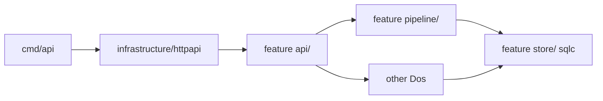

# Module layout

Target Go layout. `cmd/ci` exists today; `internal/` product packages are
still the target. [ADR](ADR.md) 4–6. Deeper file lists:
[infrastructure](../infrastructure/file-trees.md) and each feature
`file-trees.md`.

Nest only when necessary. Default is a `.go` file in the parent. Create a
subdirectory when the file would pass ~800 **or** there is a functional
split (import DAG / wrappers; `api/` vs `pipeline/`; sqlc `store/`;
`profile/media` own querier; certifications HTTP vs reviews HTTP vs
Details HTTP). Do not pre-create empty folders.

```text
cmd/
  api/                      # process; in-process River; RegisterWorkers
  ci/                       # CI/dev checks (not deployed)
internal/
  infrastructure/           # not owner surfaces; not infra/; not platform/
    config/                 # env + feature-flag bools
    httpapi/                # mux only (chi, errors, health, OpenAPI)
    tenancy/                # tenants.go, memberships.go
      auth/                 # Clerk SDK + Auth-mode helpers (picked by Register)
      store/                # sqlc for auth.tenants / memberships
    store/                  # pool, Tx, goose SQL under migrations/, sqlc.yaml
    ai/                     # vendor LLM/Voice/image + traces; load/interpolate
      store/                # sqlc for schema ai
    files/                  # object storage, signed URLs
      store/                # sqlc for schema files
  onboarding/
    api/                    # Register + auth helper; dto.go until api/dto/
    pipeline/               # Dos / workers (numbered files, not per-step pkgs)
    websitepreview/         # 08 Preview website address share HTTP (not SSE)
    websiteeditor/          # onboarding website editor wrapper
      knowledge/            # knowledge_base_registry.yaml, knowledge_*.md
    assistant/              # Onboarding assistant; must not import assistant/
      knowledge/
    media/                  # onboarding media library wrapper → profile/media
    details/                # onboarding Details wrapper → profile service.go
    store/                  # sqlc for onboarding.* only
  etl/
    service.go              # StartRun; split to service/ if it grows
    extract/<etl_run_kind>/
    transform/<etl_run_kind>/
    store/
    prompts.yaml
    jobs.go                 # scheduled_etl
  profile/
    service.go              # business profile Dos; outsiders **call** this
    store/                  # sqlc for Details / Projects / certs / reviews
    details/                # CMS Details HTTP; **calls** service.go
    projects/               # CMS Projects HTTP; prompts.yaml (inline AI assistance)
    certifications/         # Register `/v1/business-profile/certifications`
    reviews/                # Register `/v1/business-profile/reviews`
    media/
      api.go                # CMS /v1/media-assets; outsiders **call** this
      jobs.go               # describe_image, sweep_stale_media_uploads
      prompts.yaml          # media_cleanup
      store/                # own sqlc
    prompts.yaml            # reviews ranking
    jobs.go                 # reviews_ranking_for_display
  website/
    api/                    # GET|POST /v1/websites + website editor Registers
    pipeline/               # Select website template through Website publication
    templates/
    assistant/              # website editor tools
    store/                  # sqlc for websites.*
    editor.go               # pages + menus + website forms + gallery projects
    publications.go         # website publications + website addresses until nest
    prompts.yaml            # Website copy generation (`GenerateWebsiteCopy`)
  assistant/                # CMS /v1/assistant; **calls** website/ + ads/assistant
    knowledge/
    store/                  # sqlc for assistant.thread_items / runs
    api.go
    dto.go
    prompts.yaml
    jobs.go                 # thread compaction
  ads/
    assistant/              # CMS Ads tools (`cleanup_image`)
      knowledge/            # stub knowledge_base_registry.yaml day one
    generation/             # day-1 /cms/ads
      api/
      pipeline/
      store/
      prompts.yaml
  billing/
    api.go
    dto.go
    service.go              # if activation **calls** more than a couple of Dos
    jobs.go                 # leftover Stripe / usage jobs
    fake.go                 # Stripe (Checkout / webhooks)
    store/
  leads/
    api.go
    dto.go
    service.go              # website + ads **call** this
    store/
apps/
  contractor-website/
  placis-website/
  demo/
packages/
  website-components/
catalog/                    # later: typed structs dumped to JSON
frontend-3/                 # CMS + onboarding including `/onboarding/preview-and-edit/`
docs/
go.mod
```

`internal/` root = **9** (cap 15): `infrastructure`, `onboarding`, `etl`,
`profile`, `website`, `assistant`, `ads`, `billing`, `leads`.
`infrastructure/` = **6** dirs (cap 9). `onboarding/` = **8** dirs.
`website/` = **5** dirs + `editor.go` + `publications.go` + `prompts.yaml`.
`profile/` = **6** dirs + `service.go` / `prompts.yaml` / `jobs.go`
(**9** at cap — do not add a seventh dir on day one). `ads/` = **2** dirs.

Go website: no `content/` package and no per-entity packages. Split
`editor.go` / `publications.go` at ~800 (still not six packages).
Onboarding 06 / onboarding website editor **reference** website
`prompts.yaml` with a smaller tool/instruction allowlist, not a second
full yaml.

`GET /v1/onboarding/events/stream` is onboarding `api/` (Review, client
interview live fill, wait teaser, website preview leftover 06). One
stream. `websitepreview/` does not Register SSE.

`POST /v1/webhooks/stripe` is an onboarding `api/` Register that
**calls** Website activation / billing. Activation checkout is `api/` +
Host helper.

Worker `/internal/website-render` and `/internal/website-publication`
stay on the contractor-website Worker, not `cmd/api`.

## Import DAG



Only `cmd/api` imports `httpapi`. `pipeline/` does not import `api/`
or `httpapi`. Callers **call** public Dos; they do not import another
feature’s `store/`.

## Rules

- **Feature-nested, not flat**: one package per feature; a leaf starts as
  a file and splits only when it grows. File-size guard (< 800 warning,
  > 1200 hard error) in CI. `apps/demo/src` hard-fails at 800
  ([CI decision 1](ci-cd.md#decisions)).
- **Folder fan-out**: a nested dir under `internal/` or
  `frontend-3/src/` may hold at most **9** entries (tracked files +
  child dirs). `internal/` root and `frontend-3/src/` may each hold at
  most **15**. **Exclude `*_test.go` and `*.test.*`**. Not `docs/`,
  `packages/`, or `apps/`. [CI and delivery](ci-cd.md).
- **One `api/` and one `pipeline/` per feature** that has both.
  Numbered **files** (`01_find_business.go` ↔ `01-find-business.md`).
  Nest those dirs at ~800, not per-step packages. Omit an `api/` **file**
  when that step has no HTTP. Skip Confirm data and Voice client
  interview (no Do). `build-profile.md` → `build_profile.go`. Pipeline
  steps: number and architecture name together (`04 Website
  publication`). Go `pipeline/` is Dos / River workers only — no
  `huma.Register`, no SSE. CI: [API home check](ci-cd.md).
- **`httpapi` is mux only.** Features do not import it. Only `cmd/api`
  imports `infrastructure/httpapi`. Huma DTOs live next to `Register` in
  `dto.go` until `api/dto/` at ~800, **not in the Register files**. Do
  not add `internal/dto/` or dump DTOs into `httpapi`. CI:
  [API home check](ci-cd.md).
- **Auth mode helpers** live in `infrastructure/tenancy/auth/`. Every
  `Register` **picks** a helper matching [api.md](api.md) **Auth modes**.
  `pipeline/` receives `tenantID` already decided.
- **sqlc:** one pool + goose in `infrastructure/store/`. Queriers per
  feature. Pipeline **calls** sqlc in that feature’s `store/`; no SQL in
  `pipeline/` step files. Callers **call** `profile` `service.go` (and
  `profile/media`); they do not import another feature’s `store/`.
  CI: [API home check](ci-cd.md) and [import DAG](ci-cd.md).
- **Jobs:** no `internal/jobs/`. Step workers in that step’s
  `pipeline/` file. Leftovers (`describe_image`, `scheduled_etl`,
  compaction, sweeps) are `jobs.go` in the owning feature. Schema `jobs`
  is River only. Index: [jobs](../infrastructure/jobs.md).
- **Audit:** no `internal/audit`, no schema `audit`.
  [audit](audit.md). [ADR](ADR.md) 7.
- **Knowledge:** per-assistant `assistant/knowledge/`
  (`knowledge_base_registry.yaml` + `knowledge_*.md`). `infrastructure/ai`
  load/interpolate only. [AI layer](../infrastructure/ai/README.md).
- **Fakes** sit beside the collaborator (`fake.go` in that package). No
  `onboarding/research/` — 02 **calls** `etl.StartRun`.
- Each feature that calls the LLM owns `prompts.yaml` in that package.
  Variables are `{{var}}` and dotted `{{aaa.bbb}}`.
- Route handlers validate input (huma) and call service functions;
  services own business rules and transactions; models are persistence
  only. Service functions accept `tenantID` explicitly.
- See [CI and delivery](ci-cd.md) for the delivery gates.

`frontend-3` keeps its own feature-local structure and is not folded
into `internal/`; the file-size guard and folder fan-out apply to it
too. Folders: [frontend stack](frontend-stack.md).
