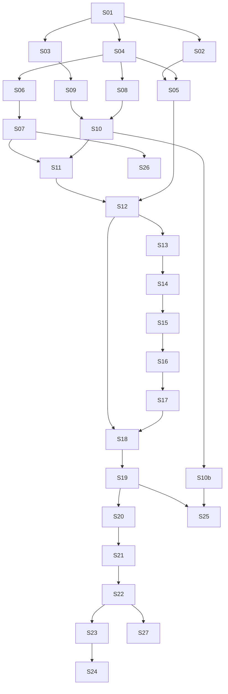

# Implementation strategy

Status: planning. Not shipped behavior. Canonical specs stay in `docs/features/`
and `docs/general-architecture/`. This file is the **order of work**: which
development task lands first, what it may depend on, and what must wait.

The product loop is already specified
([product](../general-prd.md)). How a development task is reviewed is
[development principles](../development-principles.md). The DAG here
is the missing piece: ETL, business profile, media library, files, AI,
River, the contractor website Worker, **frontend-3**, and voice sit
*inside* that loop as hard dependencies.

Product Go does not exist yet (`internal/` empty, no `migrations/`).
Only `cmd/ci` checkers and docs. `frontend-2/` may still sit on disk
until S02. The walking skeleton is the first work.

## Purpose

Implement from named lists, in this order, one PR per development
task. A development task that has owner UI includes matching
`frontend-3` screens. Do not
invent tables, routes, DTOs, River job kinds, or tests. Those already
live in per-feature `persistence.md` / `api.md` / `testing.md` /
`pipeline/` and [jobs](../general-architecture/jobs.md).

Do not add `epics.md` or `tasks.md` that restate those lists. A fat
development task may later get a thin pack under `docs/planning/` that
**cites** existing names. Do not pre-write those packs.

## Rules

Restates, does not replace, [development principles](../development-principles.md):

- Docs first, then owner review, then Go or `frontend-3`. Named lists
  in `persistence.md`, `api.md`, and `testing.md` must exist and be
  reviewed first ([AGENTS.md](../../AGENTS.md)).
- **Done** = green CI + the development task’s named HappyPath / E2E +
  regenerated types from Go `/openapi.json`. Not scaffolded, not compiles.
- Fake Google, the LLM, Stripe, and voice in tests. Prefer fake Clerk
  (`Principal`). No Clerk testing-token CI unless asked. Playwright
  uses a fresh port (do not `reuseExistingServer` against 5173/5174).
- `tenant_id` on every tenant-owned row. Services take `tenantID`
  explicitly.
- Pipeline stages: number and architecture name together (`01 Find the
  business`, never bare `01`).
- Size is not the metric. The old “~5 features / a tenth of 71k lines”
  cut is historical. Per-file 800 / hard 1200 is the size control
  ([module layout](../general-architecture/module-layout.md)).
- Owner SPA is **`frontend-3`** (Vite + React + TanStack Router /
  Query, types from Go `/openapi.json`). Delete `frontend-2` before the
  first owner-UI implementation. Do not open `frontend-2`, copy from
  it, or keep-versus-delete against it. Screens come from each feature’s
  `frontend.md` and [CMS frontend](../general-architecture/cms/frontend.md).
  Look is [`apps/demo/`](../../apps/demo/README.md). Do not follow
  [planning/frontend-debloat.md](frontend-debloat.md) as a port order
  (withdrawn).
- Size of a development task: finer than a feature, coarser than one
  table. Never “add website”. Typical development task is one pipeline
  step or one platform package, plus the `frontend-3` screen that
  calls those Routes when there is owner UI.
- If a feature’s HappyPath Full E2E needs later development tasks, the
  early development task ships Integration HappyPath only. The E2E
  lands on the development task that closes the owner journey.
- Go-only development tasks still export OpenAPI so `frontend-3`
  typegen can follow. Do not leave `frontend-3` calling routes that
  are not in the served spec.
- Branch / PR names use the development-task id (`S04-tenancy-auth`).

This file is the queue. The next change is the first development task
whose **Depends on** is merged and **Blocked by** is empty.

## Hard dependency graph

Edges are “must merge before”. `frontend-3` is on the critical path,
not a later port. ETL, files, and AI stay backend-first until a screen
exists; they still block the onboarding UI that displays their results.

## Development-task list

Each development task is one PR unless a later pack splits Go then UI. Fields:
**Depends on**, **Owns**, **Must not**, **Done when**, **Blocked by**.

### S01 Walking skeleton (Go)

- **Depends on:** none
- **Owns:** `cmd/api`, `internal/config`, slog, huma `GET /v1/health`
  and `GET /openapi.json`
  ([HTTP conventions](../general-architecture/api.md)), goose
  `CREATE SCHEMA` for the namespaces in
  [persistence](../general-architecture/persistence.md), sqlc,
  in-process River, Testcontainers Postgres, OpenAPI export
- **Must not:** product tables, Clerk, Stripe, `frontend-3` screens
- **Done when:** `TestHappyPath` for those two Routes
  ([testing](../general-architecture/testing.md)); `go test ./...`
  green; OpenAPI export has no unconstrained DTO fields
- **Blocked by:** none

### S02 `frontend-3` scaffold

- **Depends on:** S01
- **Owns:** add `frontend-3/` (Vite + React + TanStack Router / Query +
  Clerk + `openapi-fetch`); typegen from Go health only; retarget CI,
  Don’t-say `--frontend`, and Playwright to `frontend-3/`. **Delete the
  `frontend-2/` tree in this development task or immediately before it.**
  ([frontend stack](../general-architecture/frontend-stack.md))
- **Must not:** open `frontend-2`, copy modules from it, port dumped
  predecessor CSS, promote `apps/demo` to the product app, owner
  screens
- **Done when:** typegen from served `/openapi.json` (health only);
  `frontend-2/` gone; CI path-filters `frontend-3/`
- **Blocked by:** none ([ADR](../general-architecture/ADR.md) 3 is on
  `main`; this development task deletes `frontend-2/`)

### S03 Files

- **Depends on:** S01
- **Owns:** `files` table + MinIO; signed URLs; no `/v1/files` HTTP
  ([files](../general-architecture/files-and-s3.md))
- **Must not:** media library HTTP, public delivery without a
  `files` row
- **Done when:** files Integration named in
  [files](../general-architecture/files-and-s3.md) / media library tests
  that this development task can close (row + MinIO object). No owner UI
- **Blocked by:** none

### S04 Tenancy and auth (Go)

- **Depends on:** S01
- **Owns:** `auth.tenants`, `auth.tenant_memberships`, `GET /v1/me`,
  Clerk SDK behind fakes (`Sessions().Verify` → `Principal`)
  ([auth](../features/other/auth/README.md))
- **Must not:** `POST /v1/tenants`, org chooser, memberships CRUD,
  `frontend-3` login (S05)
- **Done when:** `TestHappyPathV1Me` and two-tenant isolation
  ([auth testing](../features/other/auth/testing.md))
- **Blocked by:** none

### S05 `frontend-3` login and `/me`

- **Depends on:** S02, S04
- **Owns:** `AuthGate`, Sign in with Google, `GET /v1/me`
  ([auth](../features/other/auth/README.md)). CMS stays closed until
  `status=active` (S20)
- **Must not:** org chooser, opening `frontend-2`
- **Done when:** frontend Integration for login / `/me`; no
  onboarding E2E yet
- **Blocked by:** none

### S06 AI layer and knowledge

- **Depends on:** S04
- **Owns:** `ai.threads`, `ai_generations`, `LLMProvider` + Voice
  adapter interfaces, `internal/knowledge/`
  ([AI layer](../general-architecture/ai-layer.md),
  [voice agent](../general-architecture/voice-agent.md))
- **Must not:** feature `prompts.yaml`, CMS assistant HTTP, billed
  spend without S07
- **Done when:** Integration that a generate records reasoning,
  visible output, and tool calls on `ai_generations` with
  `thread_id` (fake LLM)
- **Blocked by:** none

### S07 Billing core

- **Depends on:** S06
- **Owns:** `AssertUsageCredit`, `RecordAIUseSpend`, AI use ledger
  tables, Price cache tables
  ([billing](../features/billing/README.md)). Onboarding LLM is
  `bill_usage=unbilled`; still persist traces. Stripe Checkout waits for
  S19
- **Must not:** Usage & billing UI, extra usage credit Checkout, change
  plan
- **Done when:** billed generate hits 402 when remaining is 0;
  unbilled generate still writes `ai_generations`
  ([billing testing](../features/billing/testing.md) rows this development task
  can close)
- **Blocked by:** none

### S08 Business profile tables

- **Depends on:** S04
- **Owns:** schema `business_profile` including projects and the
  increment writer
  ([Details persistence](../features/business-profile/details/persistence.md),
  [projects persistence](../features/business-profile/projects/persistence.md))
- **Must not:** CMS Details / Projects HTTP (S21), ETL transform
  (S10)
- **Done when:** table Integration (insert increment, two-tenant
  isolation). No owner UI
- **Blocked by:** none

### S09 Media library (Go)

- **Depends on:** S03, S04
- **Owns:** `media_assets`, `media_asset_classifications`, upload hops,
  WebP, `describe_image`, `sweep_stale_media_uploads`
  ([media library](../features/other/media/README.md)). Onboarding token
  wrappers wait for S11
  (`POST /v1/onboarding/media-assets/start-upload`)
- **Must not:** `/cms/media` UI (S22), ads gallery (S23)
- **Done when:** media library Integration HappyPath rows for
  `/v1/media-assets` that do not need an activated CMS screen
  ([media library testing](../features/other/media/testing.md))
- **Blocked by:** none

### S10 ETL `StartRun` and Google Maps listing

- **Depends on:** S07, S08, S09
- **Owns:** `etl.runs`, `etl.sources`, Google Maps extract and
  transform, `StartRun(trigger=onboarding, bill_usage=unbilled)`
  ([ETL](../features/etl/README.md),
  [02 Business research](../features/onboarding/pipeline/02-business-research.md)).
  02 only **calls** `StartRun`
- **Must not:** owner CMS screen, scheduled ETL (S25), other ETL
  run kinds (S10b)
- **Done when:** `TestPipelineHappyPath` for Google Maps extract then
  transform
  ([ETL pipeline testing](../features/etl/pipeline/testing/README.md))
- **Blocked by:** none

Follow-on PRs (**S10b**), same depends-on as S10, do not block S11 as
long as Maps can start: Facebook, Instagram, website crawl, web
search, trade registry, projects-from-source,
`reviews_ranking_for_display`
([ETL pipeline](../features/etl/pipeline/README.md),
[jobs](../general-architecture/jobs.md)).

### S11 Onboarding 01 Find the business through 04a Text client interview (Go)

- **Depends on:** S10
- **Owns:** onboarding sessions, business lookup, SSE,
  `PUT /v1/onboarding/sources`, 04a Text client interview, build-profile,
  onboarding guide (`tools=[]`), onboarding media library wrappers.
  Skip 03 Review Persist (frontend extra). Do not implement
  04b Voice client interview
  ([onboarding pipeline](../features/onboarding/pipeline/README.md))
- **Must not:** 05–09, CMS `/v1/websites/…` while unactivated, 04b
- **Done when:** `TestPipelineHappyPath` for 01, 02, 04a,
  build-profile; Route HappyPath for lookup, profile GET, client
  interview PUT/complete, SSE, onboarding media library
  ([onboarding testing](../features/onboarding/testing.md),
  [pipeline testing](../features/onboarding/pipeline/testing/README.md))
- **Blocked by:** onboarding sep-3 **9** (Review “change the
  business” for `PUT /v1/onboarding/sources`) and **14**
  (`OnboardingLiveBusinessProfileRead` missing projects and photos).
  Close those in docs PRs first

### S12 `frontend-3` Find, Review, client interview

- **Depends on:** S05, S11
- **Owns:** `/onboarding/find`, `/onboarding/review`,
  `/onboarding/interview` from
  [onboarding frontend](../features/onboarding/frontend.md). SSE on
  Review and client interview. Text client interview. Look from
  `apps/demo/` `/onboarding/*`
- **Must not:** wait teaser, unpaid website editor, 04b writer,
  reading `frontend-2`
- **Done when:** frontend Integration HappyPath for those three
  routes; E2E through client interview complete if S13+ are not in
  yet
- **Blocked by:** same as S11

### S13 Website 01 Select website template and 02 Copy website template pages

- **Depends on:** S12
- **Owns:** unpublished `website_*` rows, website template catalog,
  `SelectWebsiteTemplate`, `CopyWebsiteTemplatePages`, River
  `select_and_copy_website_template`
  ([website pipeline](../features/website/pipeline/README.md),
  [05 Select and copy the website template](../features/onboarding/pipeline/05-select-and-copy-website-template.md))
- **Must not:** `GenerateWebsiteCopy` (S15), `PublishWebsite` (S16),
  CMS `POST /v1/websites` create (deferred)
- **Done when:** `TestPipelineHappyPath` for website 01 and 02
  ([website pipeline testing](../features/website/pipeline/testing/README.md))
- **Blocked by:** none

### S14 Contractor website `websiteRender`

- **Depends on:** S13
- **Owns:** `POST /internal/website-render`, thin Worker, website
  component catalog in `packages/website-components`
  ([website HTTP](../features/website/api.md),
  [contractor website cuts](../features/website/contractor-website-debloat.md))
- **Must not:** live GET calling Go, `websitePublication` (S16)
- **Done when:** `TestHappyPathInternalWebsiteRender` (Worker
  container)
  ([testing](../general-architecture/testing.md))
- **Blocked by:** none (Worker binding name is an open question in
  [website template catalog](../features/website/catalog.md); do not
  invent it — stop
  and ask if the development task cannot land without it)

### S15 03 Generate website copy

- **Depends on:** S14
- **Owns:** River `website_copy_generation`,
  `GenerateWebsiteCopy`, onboarding 06 with `bill_usage=unbilled`
  ([03 Generate website copy](../features/website/pipeline/03-website-copy-generation.md),
  [06 Generate website copy](../features/onboarding/pipeline/06-website-copy-generation.md))
- **Must not:** website publication, CMS billed create
- **Done when:** `TestPipelineHappyPath` for website 03 / onboarding
  06 (fake LLM, real Worker)
- **Blocked by:** none

### S16 04 Website publication

- **Depends on:** S15
- **Owns:** `PublishWebsite`, `websitePublication`, R2 `latest/`,
  purge. Live GET is Cache then R2 and never calls Go
  ([04 Website publication](../features/website/pipeline/04-website-publication.md),
  [website Cloudflare](../features/website/cloudflare.md))
- **Must not:** CMS Publish UI (S22), activation (S19)
- **Done when:** `TestPipelineHappyPath` for website 04; Worker
  `websitePublication` HappyPath
- **Blocked by:** none

### S17 Onboarding 05–08 (Go)

- **Depends on:** S16
- **Owns:** thin triggers into website 01–04; wait teaser data; unpaid website
  preview Assistant (07); optional 08 Preview website address
  (`POST /v1/onboarding/website/publications`)
  ([05](../features/onboarding/pipeline/05-select-and-copy-website-template.md)–[08 Preview website address](../features/onboarding/pipeline/08-preview-website-address.md), [onboarding website editor](../features/onboarding/website-editor.md))
- **Must not:** 09 pay, CMS `/v1/assistant/…`
- **Done when:** pipeline tests for 05–08; unpaid website editor
  Route HappyPath
- **Blocked by:** onboarding sep-3 **18** (resume
  `preview_website_address` reader) — docs first. Item **16** (stale
  08 / 07 sentences) is copy drift, not a Go blocker

### S18 `frontend-3` wait teaser and unpaid website preview

- **Depends on:** S12, S17
- **Owns:** `/onboarding/preview`, `/onboarding/preview-and-edit/`.
  Canvas talks to `/v1/onboarding/website/…`
  ([onboarding frontend](../features/onboarding/frontend.md))
- **Must not:** CMS website editor path while unactivated, 04b
- **Done when:** frontend Integration for those routes; E2E Find →
  wait-end → unpaid canvas if S20 is not in yet
- **Blocked by:** same as S17

### S19 09 Website activation and Stripe Subscription (Go)

- **Depends on:** S18
- **Owns:** `POST /v1/onboarding/activation/checkout`, webhook,
  River `website_activation` **calls** `PublishWebsite` and
  `ActivateSubscription`
  ([09 Website activation](../features/onboarding/pipeline/09-website-activation.md),
  [billing](../features/billing/README.md))
- **Must not:** change plan, extra office members
- **Done when:** pipeline test for 09; Stripe test-mode SDK
  allowed
  ([onboarding testing](../features/onboarding/testing.md))
- **Blocked by:** none

### S20 `frontend-3` pay strip

- **Depends on:** S19
- **Owns:** 09 Checkout on the preview website address / pay strip;
  post-pay `status=active` then `/cms/website`
  ([onboarding frontend](../features/onboarding/frontend.md),
  [auth](../features/other/auth/README.md))
- **Must not:** Usage & billing screen (S22)
- **Done when:** E2E onboarding through activation (Worker up)
- **Blocked by:** none

### S21 CMS (Go)

- **Depends on:** S20
- **Owns:** activated website editor HTTP
  (`/v1/websites/{website_prefix}/editor/…`), Details / Projects /
  Certifications and reviews HTTP, `/v1/media-assets` CMS callers,
  CMS assistant `/v1/assistant/…` (text + voice as a channel, not a
  later phase)
  ([website](../features/website/README.md),
  [business profile](../features/business-profile/README.md),
  [assistant](../features/assistant/README.md))
- **Must not:** `POST /v1/websites` create (deferred), ads (S23)
- **Done when:** Route HappyPath for those `api.md` files
- **Blocked by:** none. Split with a PR pack if one PR is too
  large (website editor HTTP, then Profile HTTP, then assistant)

### S22 `frontend-3` CMS

- **Depends on:** S21
- **Owns:** left nav, `/cms` two cards, `/cms/website/{website_prefix}`,
  Profile children, `/cms/media`, assistant DustOrb
  ([CMS frontend](../general-architecture/cms/frontend.md)). Look
  from `apps/demo/` `/cms/*`
- **Must not:** Sites list / create another website, `/cms/proof`,
  reading `frontend-2`
- **Done when:** `HappyPath` Full frontend journeys named in website,
  Details, Projects, media library, assistant `testing.md`; E2E CMS
  after activation
- **Blocked by:** none. Split with a PR pack (nav + Details first,
  then website editor, then assistant) if needed

### S23 Ads 01–04

- **Depends on:** S22
- **Owns:** `CreateAd`, `GenerateAdDraft`, `ApproveAd`,
  `ExportAdSet`, River `ads_generate`, `/cms/ads`
  ([ads pipeline](../features/ads/ad-generation/pipeline/README.md),
  [ads frontend](../features/ads/ad-generation/frontend.md)).
  Terminal Ad status is **ad ready to post**. No ad posting
- **Must not:** Meta ad posting, audience picker (deferred), video ads
- **Done when:** pipeline tests 01–04; ads E2E
  ([ads testing](../features/ads/ad-generation/testing.md))
- **Blocked by:** ads [open questions](../features/ads/README.md#open-questions)
  (empty format / `review_status`). Answer or explicitly default in
  docs before this development task. Does not block S01–S22

### S24 Leads

- **Depends on:** S23 (ads detail links) and S16 (website form POST
  can land with S16; `/cms/leads` waits on S22)
- **Owns:** `leads` table, website form POST, `/cms/leads`
  ([leads](../features/other/leads/README.md))
- **Must not:** CRM, quotes, pipelines
- **Done when:** website E2E website form → website lead; leads list
  Integration
  ([leads testing](../features/other/leads/testing.md),
  [website testing](../features/website/testing.md))
- **Blocked by:** none

### S25 Scheduled ETL

- **Depends on:** S10b, S19
- **Owns:** River `scheduled_etl`, Monday / Wednesday / Friday,
  Google Maps / Facebook / Instagram only
  ([ETL](../features/etl/README.md))
- **Must not:** crawl / web search / trade registry on the schedule
- **Done when:** Integration for `scheduled_etl` **calls**
  `StartRun(trigger=scheduled)`
- **Blocked by:** none

### S26 Placis website

- **Depends on:** S07 for `/pricing/` (bakes from
  `GET /v1/billing/catalog`). Non-pricing pages do not wait on S07
- **Owns:** `apps/placis-website` Astro static → R2, hostname
  `placis.com`
  ([Placis website](../features/placis-website/README.md))
- **Must not:** Go HTTP on this origin, Stripe on this origin, legal
  routes until copy exists
- **Done when:** Playwright against the static build
  ([Placis website testing](../features/placis-website/testing.md))
- **Blocked by:** none

### S27 Audit hardening

- **Depends on:** S22
- **Owns:** completeness of `audit_events` and AI-trace
  reconstructability
  ([audit](../general-architecture/audit.md),
  [AI layer](../general-architecture/ai-layer.md))
- **Must not:** new product features
- **Done when:** every LLM call in the shipped development tasks is
  reconstructable (reasoning, visible output, tool calls)
- **Blocked by:** none. Later development task
  ([development principles](../development-principles.md))

## Parallel tracks

Not on the critical path. Do not stall S01 on these.

- **Look** — [`apps/demo/`](../../apps/demo/README.md) continues
  independently; design decision records, not persistence/API.
  `frontend-3` may match tokens and interaction from demo; it does not
  import demo mock stores as the product data layer
- **Contractor website cuts** — keep the website component catalog,
  write-thin Worker; can start at S14
  ([contractor website debloat](../features/website/contractor-website-debloat.md))
- **Placis website non-pricing pages** — can start anytime; Pricing
  waits on the price list (S07 / S26)

There is no `frontend-2` port track.

## Blocked and not this pass

### Doc gaps (close in docs PRs before the named development task)

- Onboarding sep-3 **9** — Review “change the business” for
  `PUT /v1/onboarding/sources` — blocks S11 / S12
- Onboarding sep-3 **14** — live business profile DTO missing
  projects and photos — blocks S11 / S12
- Onboarding sep-3 **18** — resume
  `preview_website_address` — blocks S17 / S18
- Ads open questions (empty carousel / `review_status` / ad
  destination glossary) — before S23
  ([ads](../features/ads/README.md#open-questions))

Onboarding sep-3 **11** and **16** are copy ownership / stale 08–07
sentences. Fix in docs; they do not block Go once 05–09 names match
the pipeline README.

### Not this pass

Do not sneak these into a development task
([product](../general-prd.md), feature ADRs):

- 04b Voice client interview writer
- CMS `POST /v1/websites` create and the deferred website list
  ([new website creation](../features/website/new-website-creation-flow.md))
- Blog posts, careers
- Ad posting, Meta application, video ads
- Extra office members, org chooser
- Change plan while `active`
- CRM / quotes / invoices / jobs / workflows / calendar / crew
- Custom-capability coding agents, website component marketplace, native
  mobile app

### Stale port docs

`frontend-debloat.md` files and leftover `frontend-2` keep-versus-delete
wording on this tree are **not** the UI plan. Do not execute them. A
later docs PR retargets or deletes them. This file does not rewrite
every leftover mention.

## Apps

Do not collapse these into “the frontend”
([processes](../general-architecture/processes.md)):

- `frontend-3` — owner CMS and onboarding
- `apps/demo/` — look (mock data, no auth, no API)
- `apps/contractor-website` — live contractor HTML and the preview
  website address
- `apps/placis-website` — placis.com (no Go HTTP)
